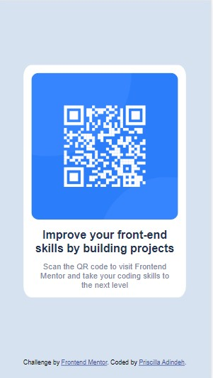
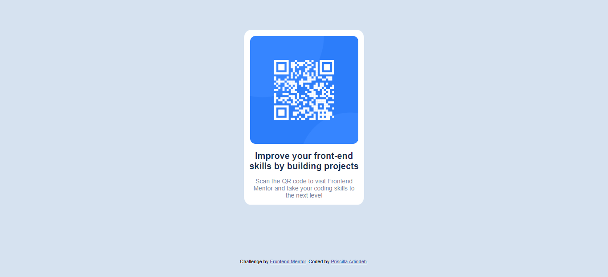

# Frontend Mentor - QR code component solution

This is a solution to the [QR code component challenge on Frontend Mentor](https://www.frontendmentor.io/challenges/qr-code-component-iux_sIO_H). Frontend Mentor challenges help you improve your coding skills by building realistic projects. 

## Table of contents

- [Overview](#overview)
  - [Screenshot](#screenshot)
  - [Links](#links)
- [My process](#my-process)
  - [Built with](#built-with)
  - [Useful resources](#useful-resources)
- [Author](#author)
- [Acknowledgments](#acknowledgments)

## Overview
There are three folders in this project;
-The design file contains the designs to be developed.
-The images folder contains the images used to develop the page.
-The screenshot folder contains the screenshot of the desktop and mobile view of the developed design.

Also the HTML file for writing the struture of the code and the external CSS file for the styling.

The style guide was downloaded from [frontendmentor.io] website.

### Screenshot

### Links

- Solution URL: [https://github.com/MAPella/QRCode-Frontend-Mentor-Challenge]
- Live Site URL: [https://mapella.github.io/QRCode-Frontend-Mentor-Challenge/]

## My process

After going through the design, I started the development by writing the HTML codes using semantics, then i styled using CSS.
I styled the desktop view first before the mobile. 

### Built with

- Semantic HTML5 markup
- CSS custom properties

### Useful resources

- [Resource 1](https://www.w3schools.com/html/html_responsive.asp) - This helped me get the code for responsiveness.
- [Resource 1](https://developer.mozilla.org/en-US/docs/Web/HTML/Element/img) - This helped me for styling the image.

## Author

- Website - [Priscilla Adindeh](https://github.com/MAPella)
- Frontend Mentor - [@yourusername](https://www.frontendmentor.io/profile/yourusername)
- Twitter - [@PAdindeh](https://www.twitter.com/PAdindeh)

## Acknowledgments
I want to thank the MDN team, the website was useful for this project. I would definetely do more with them.